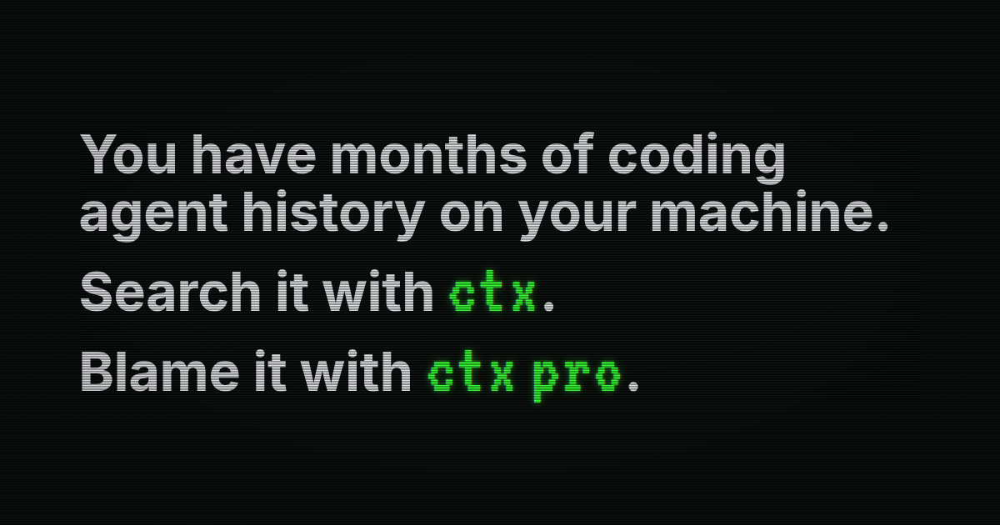

ctx is an open-source CLI for fast local search across your past coding agent sessions. Give ctx Pro any committed line of code and it surfaces the original transcript of the agent session that produced it.

Coding agents usually start from zero. They can inspect the current repo, but they often cannot recover the discussions, decisions, failed attempts, commands, and test results from earlier work.

Those sessions are full of useful context:

- decisions, constraints, intent, and rejected approaches from you
- bug investigations, refactors, file paths, commands, patches, and notes from previous agents

ctx indexes those logs into a local search index on your machine, then gives current and future agents a CLI for finding the prior discussion, command, or failed attempt before they repeat it.

## Install and set up ctx

macOS and Linux:
```bash
curl -fsSL https://ctx.rs/install | sh
```

Windows PowerShell:
```powershell
irm https://ctx.rs/install.ps1 | iex
```

FreeBSD does not receive a prebuilt release binary. Build it from source with
the repository's Bazel target; FreeBSD support is best effort and does not
block releases. See [source builds](docs/unmanaged-installs.md#source-builds).

or prompt your agent:
```
Please install and set up ctx CLI (see github.com/ctxrs/ctx)
```

## 50x more token-efficient than raw transcript search

By structuring agent history into sessions, events, metadata, and indexed fields, then returning ranked cited matches, agents can access meaningful history with far fewer tokens than raw search. Results vary by query and corpus, but raw search is often so token-heavy that it can be effectively the same as not having usable history.


## ctx Pro: git blame, but for agent sessions

`git blame` tells you which commit last changed a line. `ctx blame` tells you which agent session produced that commit, with exact citations back to the original transcript and recorded tool calls.

Agents use `ctx blame` to recover context that no longer exists anywhere near the current session. Starting from a file, line range, commit, or PR, they can find the historical agent sessions behind the code and recover the decisions, constraints, failed approaches, and assumptions recorded there.

This helps agents:

- recover constraints and decisions no longer visible in the code
- uncover assumptions embedded in earlier changes
- avoid retrying approaches that already failed
- resume work without relying on lossy compaction summaries
- audit past agent work to improve instructions, tools, and workflows

Every attribution includes supporting evidence. ctx distinguishes proven producers from possible ones and can return no producer instead of inventing an attribution.

```bash
# Your agent is investigating why customized cart items
# are disappearing from your e-commerce app.
$ ctx blame file src/checkout.ts --lines 118:146

# ctx blame finds the agent session behind those lines:
# Lines 118–146
#   commit    8f3c2a1
#   Produced by
#     session   c0297b8a-2ad7-4f73-a826-8ee9387cd1f4
#     evidence  [1] [2]

# Your agent opens the transcript of the session that produced the offending commit
$ ctx show session c0297b8a-2ad7-4f73-a826-8ee9387cd1f4

# Previous agent — transcript excerpt
"Some responses contain multiple cart lines with the same product_id.
I'm treating those as duplicates and merging them before calculating the total."

# Your agent finds the mistake
"FOUND IT: The previous agent treated matching product_ids as duplicate cart lines.
Customized items can share a product ID, so that merge drops valid items."
```

`ctx blame` can also start from a commit or PR:

```bash
ctx blame commit <sha>
ctx blame pr https://github.com/your-org/your-repo/pull/42
```

Blame computation and evidence retrieval run locally. ctx's commercial service handles trial, account, billing, and referral state; your transcripts, tool calls, source code, Git data, and derived Pro graph never leave your machine.

Try ctx Pro free for 14 days—no account or credit card required. After the trial, ctx Pro is $20 USD per month with no annual plan.

Install ctx and start the trial:

```bash
curl -fsSL https://ctx.rs/install | sh -s -- --pro-trial
```

Already use ctx?

```bash
ctx pro
```

## How is it so fast?

ctx is written in Rust, but that's not the main reason why it's fast. It turns provider history directly into one immutable, self-contained [Tantivy](https://github.com/quickwit-oss/tantivy) Core: the full-text search index and the complete normalized local record in the same generation. There is no relational database on the history-search path, and ordinary reads never need to reopen or reparse provider transcripts.

Tantivy builds the index in parallel and searches memory-mapped segments with BM25. A script-aware tokenizer keeps CJK and other dense-script history searchable. In our benchmark, ctx indexed 10 GB of agent history (740,008 records) in under 80 seconds and kept unfiltered top-20 searches below 100 ms at p95.

When semantic search is enabled, ctx embeds history locally with `multilingual-e5-small` and stores normalized vectors in memory-mapped flat-F32 segments. It scans those vectors exactly, with no vector database or HNSW graph to build or tune.

## How it works

Your past agent sessions begin in local provider history files. `ctx setup` discovers supported sources, reads those records without modifying them, and publishes complete normalized sessions and events into an immutable Core generation. Search, show, locate, MCP, semantic indexing, and ctx Pro all start from that same verified local history.

Core is local and private by default. Transcript text is preserved rather than hiding local paths or secret-shaped strings, so review copied output before sharing it outside the machine.

```bash
# Index all of your existing local agent sessions
ctx setup

# Your agent can search prior work with normal language
ctx search "failed migration"

# Search sessions/events that touched a file
ctx search --file crates/foo/src/lib.rs

# Or search multiple terms
ctx search --term "failed migration" --term rollback --term "cursor rename"

# Results include matching sessions, snippets, and ctx IDs
# evt_01h...  ses_01h...  codex  "migration expected the old cursor name" ...

# Print the matching part of the old transcript
ctx show event <ctx-event-id> --window 3

# Or print a compact transcript of the original session
ctx show session <ctx-session-id>
```

Those IDs let your current agent recover as much context from previous sessions as it needs.

ctx does not send your prompts, transcripts, or indexed history to a cloud service, call model APIs, require API keys, or write into your source repositories.

The installed binary also includes local docs and man-page generation:

```bash
ctx docs search "upgrade"
ctx docs show cli-reference
ctx docs man --print ctx
```

Official installer-managed binaries support signed self-upgrades:

```bash
ctx upgrade status
ctx upgrade check
```

Source builds and package-manager installs remain unmanaged and do not self-upgrade.

For the full pipeline, see [How ctx works](https://ctx.rs/concepts/how-it-works). For a quick first run, see [Quickstart](https://ctx.rs/first-search).

## Refer a developer. Earn $10/month toward your agent bill.

Up to $120 per friend.

Coding agents aren't cheap. For each developer you refer who becomes a ctx Pro subscriber, you earn $10 cash for each of their first 12 qualifying paid months.

Two active referrals earn you $20 per month. Ten earn you $100 per month.

The developer you refer gets a 30-day Pro trial instead of the standard 14 days.

```bash
# Claim your referral codename
ctx referral create <codename>

# Share this command with another developer
ctx pro --referral <codename>
```

[See referral details](https://ctx.rs/pro/referrals) for eligibility, payouts, and terms.

## Supported agent histories

Support means ctx can discover or read that harness's persisted local history and import it into the local search index. Use `ctx sources --format json` on your machine to see which sources are currently `importable`.

| Agent harness | Support |
| --- | --- |
| Claude Code | Supported |
| Codex | Supported |
| Grok Build | Supported |
| DeepSeek Harness | Supported |
| Cursor | Supported |
| Pi | Supported |
| GitHub Copilot CLI | Supported |
| OpenCode | Supported |
| Gemini CLI / Antigravity | Supported |
| Factory AI Droid | Supported |
| OpenClaw | Supported |
| Hermes Agent | Supported |
| AstrBot | Supported |
| NanoClaw | Supported |
| Shelley | Supported |
| Auggie / Augment | Supported |
| Cline / Roo Code | Supported |
| CodeBuddy | Supported |
| Continue | Supported |
| Crush | Supported |
| Deep Agents | Supported |
| Firebender | Supported |
| ForgeCode | Supported |
| Goose | Supported |
| Junie | Supported |
| Kilo Code | Supported |
| Kimi Code CLI | Supported |
| Kiro CLI | Supported |
| Lingma | Supported |
| MiMo Code | Supported |
| Mistral Vibe | Supported |
| Mux | Supported |
| OpenHands | Supported |
| Qoder | Supported |
| Qwen Code | Supported |
| Rovo Dev | Supported |
| Tabnine CLI | Supported |
| Trae / Trae CN | Supported |
| Warp | Supported |
| Windsurf | Supported |
| Zed | Supported |

## How ctx compares

Agent memory tools help agents carry useful state into future interactions, often through extracted facts, summaries, vectors, or graph nodes. ctx retrieves what actually happened: the original sessions, commands, tool calls, and cited evidence. `ctx blame` adds agent work provenance by connecting committed code back to those records.

Graphify-style tools answer a different question. They map the current repository: files, symbols, imports, folders, and relationships. ctx searches the prior agent sessions that explain what happened while people and agents changed that repository.

ctx keeps retrieval tied to sessions and events, so another agent can inspect the source before using it. Read more about [agent memory](https://ctx.rs/comparisons/agent-memory), [Graphify-style codebase graphs](https://ctx.rs/comparisons/codebase-graphs), and [grep or log search](https://ctx.rs/comparisons/grep-log-search).

## Explore the docs

| Page | What it covers |
| --- | --- |
| [Install](https://ctx.rs/getting-started/install) | Install ctx, initialize local storage, and index discovered local history. |
| [Quickstart](https://ctx.rs/first-search) | Search local history, inspect an event, open the session, and use JSON output. |
| [ctx Pro and referrals](https://ctx.rs/reference/cli#ctx-pro-and-referrals) | Start or manage ctx Pro and use the person-to-person referral commands. |
| [Referral details](https://ctx.rs/pro/referrals) | Review referral eligibility, commissions, payouts, and terms. |
| [Install the ctx skill](https://ctx.rs/skill) | Install the agent-history search skill with the open skills installer. |
| [Package managers and unmanaged installs](docs/unmanaged-installs.md) | Install from GitHub Releases, mise, Homebrew, or source builds. |
| [Agent plugin installs](docs/agent-skill-install.md) | Install the ctx skill through Codex, Claude Code, Cursor, or a raw skill folder. |
| [SDKs](docs/sdks.md) | Use ctx agent history search from TypeScript, Python, Rust, Go, JVM, Swift, or .NET code. |
| [Custom history plugins](docs/history-source-plugins.md) | Build an advanced local adapter for agent formats ctx does not support natively. |
| [Cursor](https://ctx.rs/agents/cursor) | Import Cursor agent transcripts and ask Cursor to cite retrieved local history before editing. |
| [How it works](https://ctx.rs/concepts/how-it-works) | Understand discovery, import, local search storage, search refresh, and cited retrieval. |
| [Supported agents](https://ctx.rs/concepts/supported-agents) | See which agent histories ctx can discover, import, and search today. |
| [CLI reference](https://ctx.rs/reference/cli) | Review setup, status, sources, import, show, locate, search, MCP, and doctor. |
